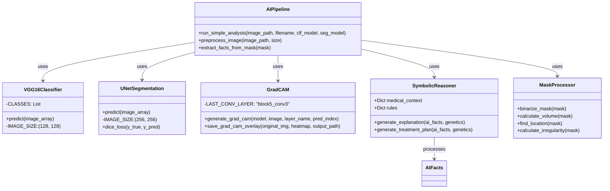
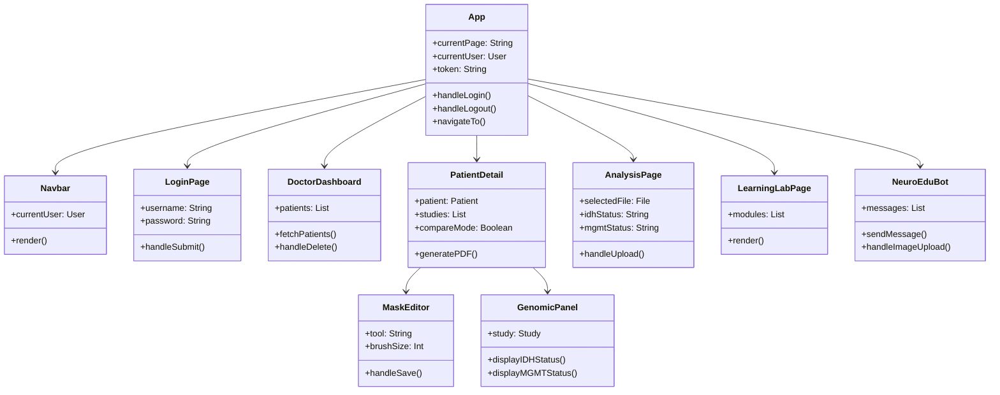

# 🧠 Neurosymbolic AI - Architecture Documentation

> **Note**: To view diagrams, press `Ctrl+Shift+V` in VS Code to open Markdown Preview

---

## 📋 Table of Contents

1. [System Architecture](#1-system-architecture)
2. [Use Case Diagrams](#2-use-case-diagrams)
3. [Sequence Diagrams](#3-sequence-diagrams)
4. [Activity Diagrams](#4-activity-diagrams)
5. [Data Flow Diagrams](#5-data-flow-diagrams)
6. [Class Diagrams](#6-class-diagrams)

---

## 1. System Architecture

### High-Level System Architecture

### Technology Stack

---

## 2. Use Case Diagrams

### Doctor Portal Use Cases

### Student Portal Use Cases

---

## 3. Sequence Diagrams

### 3.1 User Authentication Flow

### 3.2 MRI Upload and AI Analysis Pipeline

### 3.3 Multi-Modal Analysis with Genetic Data

### 3.4 PDF Report Generation

---

## 4. Activity Diagrams

### 4.1 AI Pipeline Processing Flow

### 4.2 Neurosymbolic Reasoning Workflow

---

## 5. Data Flow Diagrams

### 5.1 DFD Level 0 (Context Diagram)

### 5.2 DFD Level 1 (Detailed Data Flows)

---

## 6. Class Diagrams

### 6.1 Backend Data Models

### 6.2 AI Pipeline Components

### 6.3 Frontend Component Hierarchy

---

## 📚 Additional Resources

- **Mermaid Documentation**: [mermaid.js.org](https://mermaid.js.org/)
- **Live Editor**: [mermaid.live](https://mermaid.live)
- **Project README**: [README.md](./README.md)

---

## 🔄 Diagram Updates

These diagrams are living documents. To update:

1. Edit the Mermaid code blocks directly in this file
2. Preview changes with `Ctrl+Shift+V`
3. Export diagrams using Mermaid Chart extension if needed

---

*Generated for AI Visualizer Project - Neurosymbolic Brain Tumor Diagnosis System*
