# 🔄 AI Visualizer Project - Comprehensive Flowchart Documentation

> **Note**: To view diagrams, press `Ctrl+Shift+V` in VS Code to open Markdown Preview

---

## 📋 Table of Contents

1. [System-Level Flowcharts](#1-system-level-flowcharts)
2. [AI Pipeline Flowcharts](#2-ai-pipeline-flowcharts)
3. [User Interaction Flowcharts](#3-user-interaction-flowcharts)
4. [Data Processing Flowcharts](#4-data-processing-flowcharts)
5. [Authentication & Authorization Flow](#5-authentication--authorization-flow)
6. [Multi-Modal Analysis Flow](#6-multi-modal-analysis-flow)

---

## 1. System-Level Flowcharts

### 1.1 Complete System Workflow

### 1.2 Application Architecture Flow

---

## 2. AI Pipeline Flowcharts

### 2.1 Complete AI Analysis Pipeline

### 2.2 Neurosymbolic Integration Flow

```mermaid
flowchart TD
    Start([Neural Network Output]) --> NeuralFacts[Extract Neural Facts]
    
    subgraph Neural["Neural Processing (Subsymbolic)"]
        NeuralFacts --> ClassLabel[Predicted Class Label]
        NeuralFacts --> ConfScore[Confidence Score]
        NeuralFacts --> SegMask[Segmentation Mask]
        NeuralFacts --> AttentionMap[Attention Heatmap]
    end
    
    subgraph Bridge["Neural-Symbolic Bridge"]
        ClassLabel --> FactExtraction[Fact Extraction Layer]
        SegMask --> FactExtraction
        
        FactExtraction --> Volume[Tumor Volume cm²]
        FactExtraction --> Location[Affected Brain Lobes]
        FactExtraction --> Shape[Shape Irregularity Index]
        FactExtraction --> Confidence[Prediction Confidence]
    end
    
    subgraph Symbolic["Symbolic Reasoning (Logic-Based)"]
        Volume --> KnowledgeBase[Medical Knowledge Base]
        Location --> KnowledgeBase
        Shape --> KnowledgeBase
        Confidence --> KnowledgeBase
        
        KnowledgeBase --> MedicalContext[Apply Medical Context]
        MedicalContext --> LogicRules[Apply Logic Rules]
        
        LogicRules --> TumorType{Classify Tumor Type}
        TumorType -->|Glioma| GliomaRules[Glioma-Specific Rules]
        TumorType -->|Meningioma| MeningiomaRules[Meningioma Rules]
        TumorType -->|Pituitary| PituitaryRules[Pituitary Rules]
        
        GliomaRules --> Reasoning[Symbolic Reasoning Engine]
        MeningiomaRules --> Reasoning
        PituitaryRules --> Reasoning
        
        Reasoning --> Explanation[Human-Readable Explanation]
        Reasoning --> Treatment[Treatment Protocol]
        Reasoning --> Severity[Severity Assessment]
    end
    
    Explanation --> Output[Final Output]
    Treatment --> Output
    Severity --> Output
    
    Output --> End([Return to User])
    
    style Neural fill:#4f46e5,color:#fff
    style Bridge fill:#f59e0b,color:#fff
    style Symbolic fill:#10b981,color:#fff
```

---

## 3. User Interaction Flowcharts

### 3.1 Doctor Workflow - Patient Analysis

### 3.2 Student Workflow - Learning Journey

---

## 4. Data Processing Flowcharts

### 4.1 DICOM File Processing

### 4.2 Mask Editing and Fact Recalculation

```mermaid
flowchart TD
    Start([Open Mask Editor]) --> LoadOriginal[Load Original Mask]
    LoadOriginal --> InitCanvas[Initialize Canvas 256x256]
    InitCanvas --> DrawMask[Draw Mask on Canvas]
    
    DrawMask --> WaitAction[Wait for User Action]
    WaitAction --> UserAction{User Action}
    
    UserAction -->|Select Brush| SetBrush[Set Tool: Brush]
    UserAction -->|Select Eraser| SetEraser[Set Tool: Eraser]
    UserAction -->|Adjust Size| ChangeBrushSize[Update Brush Size]
    UserAction -->|Draw| DrawOnCanvas[Draw on Canvas]
    UserAction -->|Save| SaveMask[Save Mask]
    UserAction -->|Cancel| CancelEdit[Cancel Changes]
    
    SetBrush --> WaitAction
    SetEraser --> WaitAction
    ChangeBrushSize --> WaitAction
    DrawOnCanvas --> UpdateCanvas[Update Canvas Display]
    UpdateCanvas --> WaitAction
    
    SaveMask --> ConvertBlob[Convert Canvas to Blob]
    ConvertBlob --> UploadMask[Upload to Server]
    UploadMask --> DecodeMask[Decode Image Bytes]
    DecodeMask --> SaveToFile[Save to File System]
    
    SaveToFile --> RecalculateFacts[Recalculate Tumor Facts]
    RecalculateFacts --> BinarizeMask[Binarize Mask]
    BinarizeMask --> CountPixels[Count Non-Zero Pixels]
    CountPixels --> CalcVolume[Calculate Volume cm²]
    
    BinarizeMask --> FindMoments[Calculate Image Moments]
    FindMoments --> FindCentroid[Find Tumor Centroid]
    FindCentroid --> DetermineLocation[Determine Brain Lobe]
    
    BinarizeMask --> FindContours[Find Contours]
    FindContours --> CalcPerimeter[Calculate Perimeter]
    FindContours --> CalcArea[Calculate Area]
    CalcPerimeter --> CalcCircularity[Calculate Circularity]
    CalcArea --> CalcCircularity
    CalcCircularity --> CalcIrregularity[Irregularity = 1 - Circularity]
    
    CalcVolume --> UpdateFacts[Update AI Facts]
    DetermineLocation --> UpdateFacts
    CalcIrregularity --> UpdateFacts
    
    UpdateFacts --> UpdateDatabase[Update Study in MongoDB]
    UpdateDatabase --> ReturnSuccess[Return Success Message]
    
    CancelEdit --> CloseEditor[Close Editor]
    ReturnSuccess --> CloseEditor
    CloseEditor --> End([Edit Complete])
    
    style RecalculateFacts fill:#4f46e5,color:#fff
    style UpdateDatabase fill:#10b981,color:#fff
```

---

## 5. Authentication & Authorization Flow

### 5.1 Complete Authentication Flow

---

## 6. Multi-Modal Analysis Flow

### 6.1 Visual + Genetic Data Integration

### 6.2 Treatment Plan Generation Logic

---

## 📚 Related Documentation

- [Architecture Documentation](./ARCHITECTURE_DOCUMENTATION.md) - System architecture diagrams
- [Component Diagram](./COMPONENT_DIAGRAM.md) - Detailed component relationships
- [README](./README.md) - Project overview and setup

---

*Generated for AI Visualizer Project - Neurosymbolic Brain Tumor Diagnosis System*
