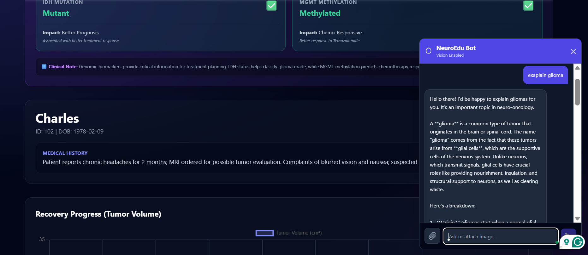

# 🧠 Neurosymbolic AI for Explainable Brain Tumor Diagnosis
### Final Year MCA Project | Advanced Medical Imaging & Education Platform

## 📖 Abstract
This project implements a **Neurosymbolic Artificial Intelligence** system to diagnose brain tumors (Glioma, Meningioma, Pituitary) from MRI scans. Unlike traditional "Black Box" AI models, this system combines **Deep Learning (Neuro)** for visual perception with **Symbolic Logic (Symbolic)** for reasoning.

The platform serves two distinct user groups:
1.  **Clinicians:** Provides automated diagnosis, segmentation, longitudinal tracking, and explainable reports.
2.  **Students:** Offers an interactive "Learning Lab" with 3D anatomy visualization, gamified diagnosis challenges, and an AI tutor.

---

## 🚀 Key Features

### 🏥 For Doctors (Clinical Support)
* **Multi-Modal AI Analysis:**
    * **CNN (VGG16):** Classifies tumor type with high accuracy.
    * **U-Net:** Generates pixel-perfect segmentation masks.
    * **Grad-CAM:** Visualizes AI attention heatmaps (XAI).
* **Neurosymbolic Reasoning:** Converts raw pixel data into human-readable logic (e.g., *"Tumor is large (>10cm³) and located in the frontal lobe, suggesting aggressive growth"*).
* **Human-in-the-Loop:** Doctors can manually edit/correct AI masks using a brush tool, ensuring 100% accuracy.
* **Longitudinal Tracking:** Compare "Before vs. After" scans with a visual difference heatmap (Growth vs. Shrinkage calculation).
* **Clinical Decision Support:** AI-generated Severity Score (0-100) and Treatment Protocol suggestions based on NCCN guidelines.
* **Reporting:** Automated PDF generation and Text-to-Speech audio summaries.
* **DICOM Support:** Handles professional medical imaging formats (`.dcm`) alongside standard images.

### 🎓 For Students (Education)
* **Interactive Learning Lab:** A dedicated module to learn brain anatomy and tumor pathology.
* **3D Neural Visualization:** Real-time simulation of the AI's neural network architecture.
* **Diagnosis Challenge:** A gamified module where students draw the tumor boundary and get an **IoU Accuracy Score** against the AI.
* **NeuroEdu Bot:** An integrated LLM-powered chatbot (OpenAI GPT-4o) for answering medical queries and analyzing uploaded diagrams.

---

## 🖼️ Project Screenshots

### 🔐 Login Interface

*Secure authentication for doctors and students*

### 🏥 Doctor Dashboard

*Main interface for clinicians with patient management and AI analysis*

### 🧠 AI-Powered Diagnosis & Analysis

*Real-time tumor classification with confidence scores*

*Comprehensive AI analysis with segmentation and heatmaps*

### 🤖 Neurosymbolic Reasoning

*AI-powered tumor classification with symbolic reasoning*

*Detailed reasoning and treatment recommendations*

### � Multi-Modal Analysis

*Integration of MRI imaging with genetic data*

*Genetic markers and molecular profiling*

### 🔍 System Pipeline & Architecture

*End-to-end AI processing pipeline visualization*

### 📊 3D Neural Network Visualization

*Interactive 3D visualization of neural network architecture*

*Detailed layer-by-layer network explanation*

### 📈 Patient Tracking & Comparison

*Longitudinal patient data and treatment progress*

*Side-by-side scan comparison with growth analysis*

### 🎓 Educational Features

#### Brain Anatomy Learning

*Interactive brain anatomy and cell structure education*

#### Tumor Types Library

*Comprehensive tumor classification library*

*Detailed tumor characteristics and pathology*

#### Diagnosis Quiz Challenge

*Gamified learning with real-time feedback and IoU scoring*

#### Interns Learning Hub

*Dedicated training module for medical students*

### 🤖 NeuroEdu AI Chatbot

*Google Gemini-powered educational assistant for medical queries*

### 🌐 Federated Learning Hub

*Collaborative multi-institutional AI training platform*

## 🛠️ Tech Stack

### **Frontend (React.js)**
* **Framework:** React.js v19.2.0
* **UI Library:** Tailwind CSS v3.4 (Glassmorphism design)
* **State Management:** React Hooks, Context API
* **HTTP Client:** Axios v1.13
* **Data Visualization:** 
  - Chart.js v4.5 (Patient progress charts)
  - React-ChartJS-2 v5.3 (React integration)
  - HTML5 Canvas (Interactive mask editing & drawing)
* **PDF Generation:** jsPDF v3.0, html2canvas v1.4
* **Audio:** Web Speech API (Text-to-Speech reports)
* **Testing:** Jest, React Testing Library

### **Backend (FastAPI + Python)**
* **Framework:** FastAPI v0.120 (Async Python web framework)
* **Server:** Uvicorn v0.38 (ASGI server)
* **Database:** 
  - MongoDB (NoSQL database)
  - Motor v3.7 (Async MongoDB driver)
  - PyMongo v4.15
* **Authentication & Security:**
  - Python-JOSE v3.5 (JWT tokens)
  - Passlib v1.7 (Password hashing)
  - Bcrypt v5.0
  - Cryptography v46.0

### **Machine Learning & AI**
* **Deep Learning Framework:** TensorFlow v2.19.0
* **Neural Network Library:** Keras v3.11
* **Model Architectures:**
  - VGG16 (Transfer learning for classification)
  - U-Net (Tumor segmentation)
  - Grad-CAM (Explainable AI visualization)
* **Computer Vision:** 
  - OpenCV v4.12 (Image processing)
  - Pillow v12.0 (Image manipulation)
* **Scientific Computing:**
  - NumPy v2.1.3 (Numerical operations)
  - SciPy v1.16.2 (Scientific algorithms)
  - Scikit-learn v1.7.2 (ML utilities)
* **Medical Imaging:** Pydicom (DICOM file processing)
* **LLM Integration:** Google Generative AI (Gemini 2.5 Flash for NeuroEdu Bot)

### **Development & Deployment**
* **Version Control:** Git, GitHub
* **Package Managers:** npm (Frontend), pip (Backend)
* **Environment Management:** Python venv, dotenv
* **API Documentation:** FastAPI auto-generated Swagger/OpenAPI
* **Logging:** Python logging, Rich v14.2 (Terminal formatting)

---

## ⚙️ Installation & Setup

### 1. Prerequisites
* Python 3.9+
* Node.js & npm
* MongoDB (Running locally on default port 27017)

### 2. Backend Setup
Navigate to the backend folder and install dependencies.

cd backend_simple
# Create virtual environment (Optional but recommended)
python -m venv venv
# Activate venv (Windows)(For backend)
.\venv_tf219\Scripts\Activate.ps1

# Install requirements
pip install -r requirements.
